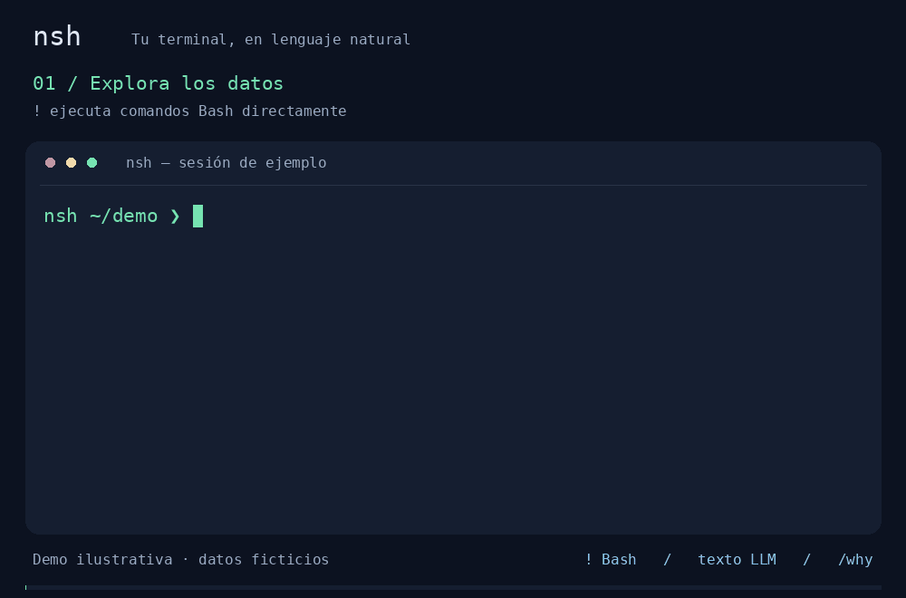

# nsh

Wrapper en Rust sobre una **bash interactiva persistente**.

## Demo de uso



Demo ilustrativa de 15 segundos con datos ficticios: `!ls` explora los logs;
el LLM busca errores 500 de `/api/pagos`, excluye pruebas y agrupa por IP.
`/why` interpreta qué IP concentra más errores y explica los filtros.
Se reproduce en bucle. [Ver imagen estática](docs/demo/nsh-demo-preview.png).

El guion reproducible está en [docs/demo/generate.py](docs/demo/generate.py).

La finalización de cada comando se verifica con una barrera de Bash de
identificador aleatorio: imprimir el marcador de sesión no adelanta el prompt
ni sustituye el código de salida real. El parser se resincroniza si encuentra
un marcador incompleto antes del siguiente marcador válido. Esta comprobación
protege la sincronización, no aísla código hostil que corre con los permisos
del usuario y acceso a la propia shell.

Las peticiones al proveedor LLM tienen un timeout de 60 segundos por intento,
incluida la lectura de la respuesta. Los errores transitorios pueden reintentarse
hasta tres veces.

## 18 - Plugins instalables (`/plugins`)

El núcleo (`!comandos` + LLM) siempre funciona. Las capacidades opcionales
son plugins que se instalan con un comando, sin editar ningún fichero:

```
nsh ~ ❯ /plugins list
  Plugins disponibles:
    documentos lee pdf/docx/xlsx vía MarkItDown (uvx)  [no instalado]
nsh ~ ❯ /plugins install documentos
  ✓ plugin 'documentos' instalado (lee pdf/docx/xlsx vía MarkItDown). Ya puedes usarlo.
```

- `/plugins list` muestra el catálogo y su estado (`instalado/desactivado/no instalado`)
- `/plugins install <nombre>` comprueba el runtime (`uvx`, `npx`, ...) en el
  PATH, escribe el bloque `[connectors.*]` en `~/.config/nsh/config.toml`
  (preservando `api_key` y permisos `0600`) y recarga el broker **en caliente**,
  sin reiniciar nsh
- `/plugins remove <nombre>` lo desactiva (`enabled = false`, se conserva el bloque)
- Si pides un documento sin el plugin, el error dice el comando exacto:
  `Instálalo con: /plugins install documentos`
- Los runtimes (`uvx`/`npx -y`) resuelven en el primer uso; `install` no descarga
  nada, igual que hacen Claude Code, Gemini CLI y OpenCode con sus MCP
- Añadir un plugin futuro es añadir una entrada al catálogo en `src/plugins.rs`;
  la detección por extensión (`is_document_reference`) ya tira del catálogo

## 19 - Modo de aprobación: `confirm` (defecto) y `yolo`

Por defecto (`approval = "confirm"`), todo lo que no es lectura pura pide
confirmación (`[e]jecutar [c]ancelar [m]odificar`).

Para una experiencia fluida, `~/.config/nsh/config.toml`:

```toml
[security]
approval = "yolo"
```

o en caliente, dentro de nsh: `/yolo` (toggle; `/yolo on` / `/yolo off`).

En `yolo` se ejecuta sin preguntar **todo** excepto lo peligroso de verdad:

| Situación | `confirm` | `yolo` |
|---|---|---|
| Lecturas, búsquedas, tuberías de lectura | ejecuta | ejecuta |
| Escribir/borrar ficheros y directorios normales, redirecciones, `tee`, globs | confirma | **ejecuta** |
| `chmod 777`, mutación del sistema (paquetes, servicios...), borrado masivo (`find -delete`) | confirma | **confirma** |
| Zonas de sistema (`/etc`, `/usr`...), escalada de privilegios, `mkfs`, `rm -rf /`, `curl ... | sh` | **deniega** | **deniega** |

## 20 - Salida limpia

El resultado de un comando se muestra tal cual, como en una terminal normal:

- Éxito: **silencio** (no hay `[terminado: 0]`).
- Fallo: una línea `[terminado: N]` con el código exacto.
- El aviso `· /why para interpretar la salida` ya no se imprime; si lo quieres
  automático, `interpret_output = "auto"` en el config.

## 14 - Scope de rutas y secretos

La politica original por rutas se ha revertido en el PASO 19 por decision explicita del usuario. El criterio actual es por tipo de accion, no por ubicacion.

- Las lecturas se permiten por defecto, aunque apunten fuera del cwd
- `cat ~/.ssh/id_rsa` vuelve a ser `Allow`
- Las rutas sensibles ya no bloquean la ejecucion; solo disparan la omision opcional de `last_output`
- `redact_sensitive_output = true|false` en `[security]` controla esa omision; por defecto `true`
- Las muestras automáticas de contexto omiten siempre el contenido de rutas
  sensibles, comprobando también el destino de enlaces simbólicos. El LLM recibe
  un aviso de omisión; esto no impide leer el fichero localmente con `!`.
- `sort` con opciones de salida (`-o`, `--output` y variantes) requiere
  confirmación aunque el LLM lo clasifique como lectura.
- Lo que sigue prohibido o confirmado se decide por accion: borrado masivo, escritura en zonas de sistema, descarga y ejecucion, escalada de privilegios, mutaciones del sistema, etc.

### Limites conocidos

Esto no es hermetico. El filtro usa lexer + clasificacion por accion, no un parser completo de Bash ni un sandbox.

- Expansiones como `$HOME` o globs de fichero nunca llegan a `Allow`; como minimo piden `Confirm`
- Hay casos de TOCTOU con symlinks y semantica de shell que no se pueden cerrar aqui
- La marca de sensibilidad de `last_output` es por ruta, no por contenido: `!env`, `!printenv` o `!docker inspect` pueden volcar secretos sin marcarse

La frontera real sigue siendo ejecutar en sandbox o contenedor aparte.

## 15-17 - Broker MCP y pre-paso documental

`nsh` ya levanta un broker MCP en un hilo separado con runtime Tokio aislado cuando hay conectores habilitados en `config.toml`.

- Transporte actual: stdio con `rmcp` estable y `TokioChildProcess`
- Handshake: `initialize` + `initialized` lo resuelve `rmcp`
- Superficie usada en el MVP: `tools/list` paginado, `tools/call`, cache invalida por `tools/list_changed`, cierre con timeout
- El broker rechaza contenido de tool no textual y limita la salida por bytes

### MarkItDown

El pre-paso documental se activa solo en texto natural cuando una referencia `@` verificada termina en `.pdf`, `.docx` o `.xlsx`.

Desde el PASO 19 tambien acepta rutas desnudas existentes con esas extensiones, con o sin `@`, absolutas o relativas, con o sin comillas, incluso con espacios.

Desde el PASO 20, si un documento se convierte con MarkItDown, `nsh` ya no intenta traducir la peticion a un comando: la manda por la ruta de respuesta en texto y muestra directamente el resumen o explicacion del modelo.

Ademas, si `plan()` no devuelve `tool_use` pero si texto, `nsh` muestra ese texto como respuesta directa en vez de tratarlo como error.

- Nunca se activa en `!`
- La URI `file:` la construye `nsh`, no el modelo
- El contenido convertido se inyecta como datos externos delimitados, nunca en el system prompt
- Si MarkItDown falla, supera el limite o no esta configurado, `nsh` no llama al LLM
- El comando final propuesto por el LLM sigue pasando entero por la politica del PASO 14

### Logs MCP

El `stderr` de los conectores MCP ya no se mezcla con la sesion del usuario.

- Por defecto se redirige a `~/.local/state/nsh/logs/mcp-<conector>.log`
- Si no se puede crear ese log, cae a `stderr = null` sin abortar el arranque
- Para depurar en vivo: `NSH_DEBUG_MCP=1 nsh` o `nsh --debug-mcp`

### Configuracion esperada

Ejemplo de `config.toml`:

```toml
[security]
roots = ["cwd"]
extra_roots = []

[connectors.markitdown]
enabled = true
command = "uvx"
args = ["markitdown-mcp==0.0.1a4"]
env = {}
working_dir = "cwd"
timeout_ms = 30000

[connectors.markitdown.tools.convert_to_markdown]
effect = "read_local"
approval = "auto_for_referenced"
roots = ["cwd"]
allowed_schemes = ["file"]
max_output_bytes = 1048576
```

## 12.1 — Listado del directorio en el contexto (arregla el bug)

El modelo ahora recibe un listado real del directorio actual, con nombres EXACTOS, marcando directorios con `/` al final, y capeado a 200 entradas. También incluye reglas explícitas sobre no cambiar mayúsculas y sobre no inventar ficheros.

## 12.2 — `@` con autocompletado

El usuario puede escribir `@` seguido de parte de una ruta y pulsar Tab para completar con fuzzy search (como fzf) o list según la configuración en `config.toml`.

## 12.3 — Resolución de `@` antes de llamar al LLM

Antes de planificar, nsh resuelve las referencias `@`:
- Expande `~`
- Verifica que la ruta existe
- Si no existe, muestra error sin llamar al LLM
- Si existe, añade la ruta a `ctx.referenced` y manda al LLM la ruta desnuda (entrecomillada si tiene espacios)
- También funciona en modo `!`
